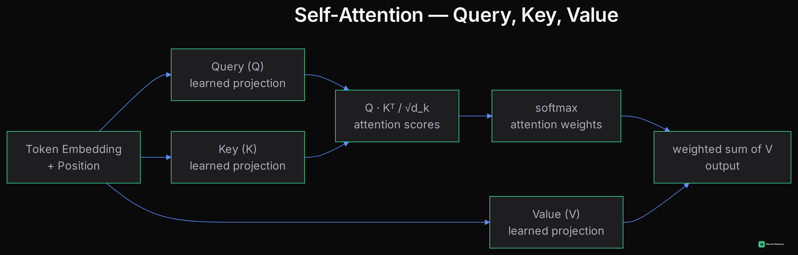

# Attention & Transformers

The architecture behind GPT, Claude, LLaMA, and essentially every modern large model — text, vision, and beyond.

## Self-Attention: Query, Key, Value

For each token, the model computes three vectors via learned linear projections: a **Query** (what am I looking for), a **Key** (what do I contain, for others to find), and a **Value** (what do I actually offer if selected).

Attention scores between token $i$ and token $j$ are computed as $Q_i \cdot K_j$ (a dot product — see [Linear Algebra](../mathematics-for-ai/linear-algebra.md)), scaled and passed through softmax to get weights, which are then used to compute a weighted sum of all Value vectors:

$$\text{Attention}(Q, K, V) = \text{softmax}\left(\frac{QK^T}{\sqrt{d_k}}\right) V$$

**Why scale by $\sqrt{d_k}$**: without scaling, dot products grow large in magnitude as dimension $d_k$ increases, pushing softmax into regions with vanishingly small gradients. Dividing by $\sqrt{d_k}$ keeps the scores in a well-behaved range regardless of dimension.

**The result**: every token can directly attend to every other token in the sequence, in a single step — no sequential bottleneck like RNNs had, and no distance penalty for far-apart tokens.

## Multi-Head Attention

Instead of one attention computation, run several in parallel ("heads"), each with its own learned Q/K/V projections, then concatenate the results. Different heads tend to specialize — one might track syntactic relationships, another long-range coreference, another local patterns. This gives the model multiple "representation subspaces" to work with simultaneously.

**Grouped-Query Attention (GQA)**: a memory/speed optimization where multiple query heads share the same key/value heads, reducing the size of the KV cache (below) at inference time with minimal quality loss — used in most modern production LLMs.

## Cross-Attention

In encoder-decoder architectures (like the original Transformer for translation), the decoder's queries attend to the *encoder's* keys and values rather than its own — letting the decoder pull relevant information from the full input sequence at every generation step. This is the direct, more powerful successor to the sequence-to-sequence bottleneck problem from [Sequence Models](./sequence-models.md).

## Positional Encoding

Attention has no inherent sense of token order — $QK^T$ treats the sequence as an unordered set unless you tell it otherwise. **Positional encoding** injects order information:

- **Absolute (sinusoidal)**: add a fixed, deterministic pattern based on position directly to each token's embedding.
- **RoPE (Rotary Position Embedding)**: instead of adding a position signal, *rotates* the Q and K vectors by an angle proportional to position — has the elegant property that the dot product between two rotated vectors naturally encodes their *relative* distance. This is the dominant choice in modern LLMs because it generalizes better to sequence lengths longer than what was seen in training.

## The Full Transformer Block

Each block is: **self-attention → add & normalize (residual + LayerNorm/RMSNorm) → feed-forward network → add & normalize** again. Stack many of these blocks, and you have GPT-style decoder-only models (predict next token, used by essentially every modern LLM), or encoder-only models (BERT-style, used for embeddings/classification), or encoder-decoder models (T5-style, used for translation/summarization).

## Vision Transformers (ViT)

Split an image into fixed-size patches, treat each patch like a "token" (via a linear projection), add positional encoding, and feed the sequence through a standard Transformer encoder. Proof that attention isn't text-specific — it's a general-purpose mechanism for relating elements of *any* sequence, which is also why multimodal models can mix image patches and text tokens in a single attention computation. See [Vision Architectures](./vision-architectures.md) for ViT's variants (DeiT, Swin) and how vision Transformers get used for detection and segmentation, not just classification.

## The Three Transformer Lineages

The original 2017 Transformer had both an encoder and a decoder (built for translation). Three families since then each kept a different piece, because different tasks need different pieces:

### Encoder-only: the BERT lineage

Keeps only the encoder — every token attends to every other token *bidirectionally* (no masking), producing rich contextual representations rather than generating text. Trained with **Masked Language Modeling** (randomly mask tokens, predict them from both left and right context) rather than next-token prediction.

- **BERT** (2018) — the original: bidirectional encoder pretraining, then fine-tuned per downstream task (classification, NER, QA). Made "pretrain then fine-tune" the standard NLP recipe.
- **RoBERTa** — BERT with a more careful, longer training recipe (more data, bigger batches, no next-sentence-prediction objective) — showed BERT itself was meaningfully undertrained, not that the architecture needed to change.
- **ALBERT** — shrinks BERT's parameter count via factorized embeddings and cross-layer parameter sharing, trading some capacity for a much smaller footprint.
- **DistilBERT** — a smaller BERT trained via **knowledge distillation** (a compact "student" model trained to match a larger "teacher" model's outputs) — roughly BERT's accuracy at a fraction of the size and latency.
- **SBERT (Sentence-BERT)** — fine-tunes BERT with a contrastive/siamese objective specifically to produce good *sentence-level* embeddings for similarity/retrieval — the direct ancestor of today's embedding models used in RAG (see [LLM Hosting & Serving Patterns](../mlops/llm-hosting-and-serving-patterns.md)).

Encoder-only models are the right choice whenever you need a representation *of* text (classification, retrieval, embeddings) rather than *generation of* text.

### Decoder-only: the GPT lineage

Keeps only the decoder, with **causal (masked) self-attention** — each token can only attend to itself and earlier tokens, never future ones, matching how text is actually generated one token at a time. Trained with plain next-token prediction on raw text at massive scale.

- **GPT / GPT-2 / GPT-3** — each generation scaled up parameters and data, with GPT-3 demonstrating that scale alone produces qualitatively new abilities (few-shot in-context learning without any fine-tuning).
- **GPT-4 and beyond, LLaMA, Mistral, Claude's underlying architecture** — all decoder-only Transformers at this point; differences between modern frontier models are mostly in data quality/scale, training technique (RLHF/RLAIF, see [LLMs & GenAI](../llms-genai/roadmap.md)), and architectural refinements (RoPE, GQA, different normalization) layered on the same decoder-only skeleton.

Decoder-only is the dominant architecture for essentially all modern general-purpose LLMs, because a single next-token objective, trained at sufficient scale, turns out to subsume translation, summarization, QA, and reasoning as special cases of "predict what comes next."

### Encoder-decoder: the T5 lineage

Keeps both halves, connected by cross-attention (above) — an encoder builds a full-context representation of the input, a decoder generates output conditioned on it. The natural fit for tasks that transform one sequence into a genuinely different one.

- **T5 (Text-to-Text Transfer Transformer)** — reframes *every* NLP task (classification, translation, summarization) as text-to-text: the input is a text prompt describing the task, the output is text — a single architecture and training objective for tasks that previously needed task-specific heads.
- **BART** — pretrained as a denoising autoencoder (corrupt text with various noise functions, reconstruct the original) — particularly strong for summarization and other generation tasks that start from an existing document.
- **Original Transformer (2017)** and **modern machine translation systems** remain the clearest encoder-decoder use case: translate French *into* English is genuinely "transform sequence A into a related but different sequence B," which is exactly what cross-attention was built for.

Encoder-decoder models have become less common for general-purpose chat/instruction-following (decoder-only dominates there), but remain a strong choice for well-defined sequence-to-sequence tasks with a clear input/output split.

## Common Problems & SOTA Solutions

- **Vanishing gradients in deep stacks** → residual connections + normalization (inherited from [Training Deep Networks](./training-deep-networks.md))
- **Quadratic cost of self-attention** ($O(n^2)$ in sequence length, see [Algorithms & Data Structures](../mathematics-for-ai/algorithms-data-structures.md)) → **Flash Attention** (a GPU-memory-aware exact implementation that avoids materializing the full attention matrix), sparse/linear attention variants for very long contexts
- **Growing KV cache during long generation** → Grouped-Query Attention, Paged Attention (memory-efficient KV cache management, covered further in [LLMs & GenAI](../llms-genai/roadmap.md))
- **Slow inference** → quantization, knowledge distillation, pruning
- **Training instability at scale** → careful initialization, warmup schedules, gradient clipping, mixed precision

Next: [Vision Architectures](./vision-architectures.md) — detection, segmentation, and the ViT variants built for them; then on to [LLMs & GenAI](../llms-genai/roadmap.md) for where this architecture becomes ChatGPT-class systems.
