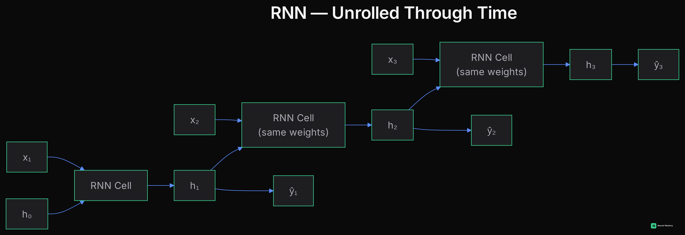
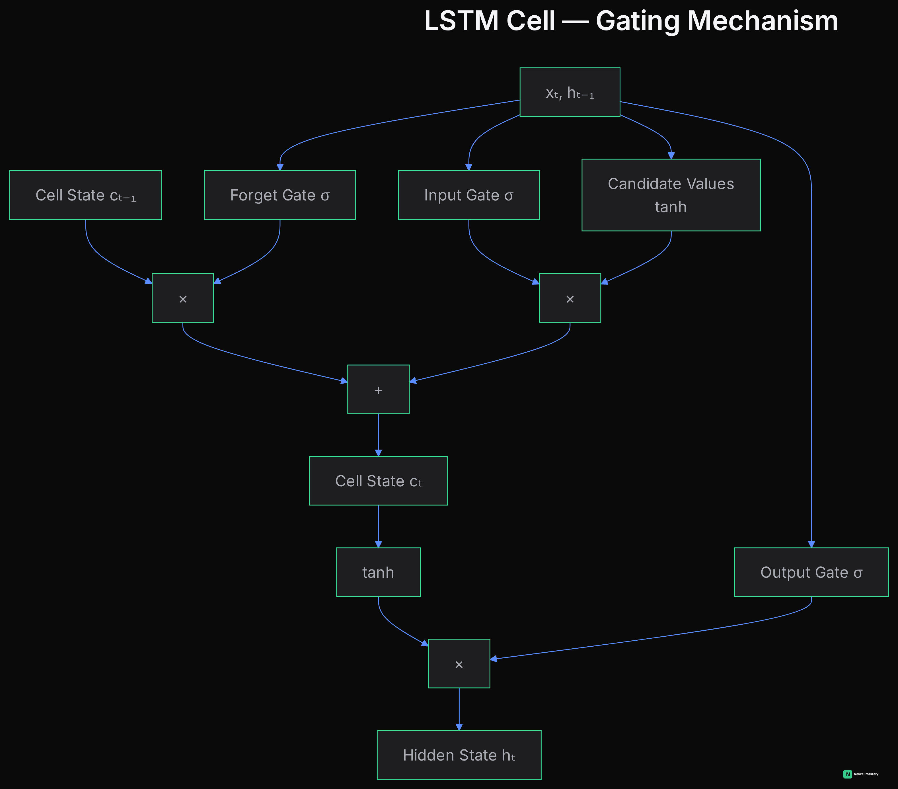
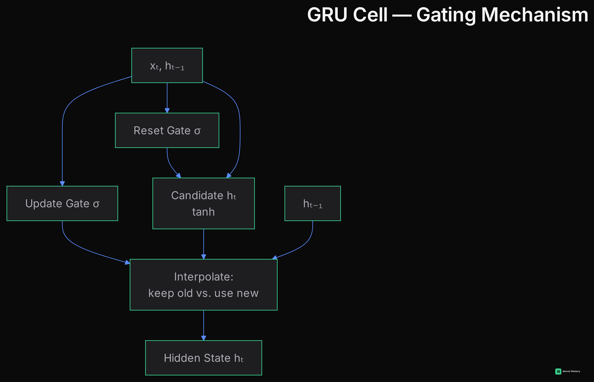
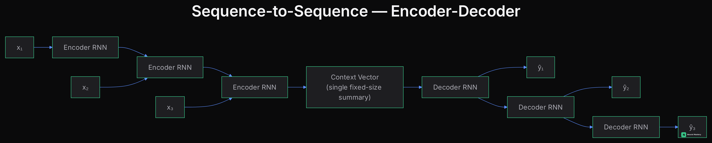
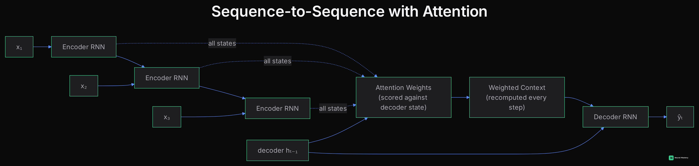

# Sequence Models

Text, audio, time series, DNA — anywhere order carries meaning, you need an architecture that processes sequences, not fixed-size independent inputs.

## Recurrent Neural Networks (RNNs)

An RNN processes a sequence one element at a time, maintaining a **hidden state** that's updated at each step and carries information forward: $h_t = f(h_{t-1}, x_t)$. In principle, this lets information from any earlier point in the sequence influence later predictions.

**The vanishing gradient problem, again**: because the same weights are applied repeatedly across many time steps, gradients during backpropagation-through-time shrink (or explode) even faster than in a deep feedforward network (see [Training Deep Networks](./training-deep-networks.md)). In practice, plain RNNs struggle to remember anything more than ~10-20 steps back.

## LSTM and GRU

**LSTM (Long Short-Term Memory)** introduces a separate "cell state" plus gating mechanisms (input, forget, output gates) that explicitly control what information gets added, kept, or discarded at each step — a direct, engineered fix for the vanishing gradient problem in RNNs.

**GRU (Gated Recurrent Unit)** simplifies LSTM's gating into two gates instead of three (reset and update, no separate cell state), with fewer parameters and often comparable performance — a common practical choice when compute is limited.

## Sequence-to-Sequence Models

For tasks where both input and output are sequences of different lengths (translation, summarization): an **encoder** RNN compresses the input sequence into a fixed representation, and a **decoder** RNN generates the output sequence from that representation, one token at a time.

**The bottleneck problem**: compressing an entire input sequence into one fixed-size vector loses information, especially for long sequences — no matter how long the input is, it has to fit through that same single vector.

## Sequence-to-Sequence with Attention

The direct fix, and the direct predecessor to the Transformer: instead of forcing the encoder to compress everything into one fixed-size context vector, let the decoder look back at *all* encoder hidden states directly, at every output step, weighted by relevance to what it's generating right now.

This is the **Bahdanau/Luong attention** mechanism: at each decoder step, score the current decoder state against every encoder state, turn those scores into weights (softmax), and take a weighted sum of the encoder states as that step's context — recomputed fresh every step, so the decoder can effectively "look at" whichever part of the input matters most for the token it's producing right now. This architecture is what proved attention works, before the 2017 "Attention Is All You Need" paper removed the RNN entirely and built a model out of attention alone (see [Attention & Transformers](./attention-transformers.md)).

## Named Variants Worth Knowing

- **Bidirectional RNN/LSTM (BiRNN/BiLSTM)**: runs two RNNs over the sequence — one forward, one backward — and concatenates their hidden states at each position, so every position's representation depends on both past *and* future context. Only usable when the full sequence is available upfront (not for streaming/online generation), which is exactly why it's common in encoders but not decoders.
- **Deep (stacked) RNN**: multiple RNN layers stacked on top of each other, the way depth helps any network — each layer's output sequence feeds the next layer as its input sequence, building progressively more abstract sequence representations.
- **Peephole LSTM**: a variant where the gates can also look at the cell state directly (not just the hidden state and input) when deciding what to forget/add — lets gating decisions depend on the actual memory content, useful for tasks sensitive to precise timing.
- **ConvLSTM**: replaces the LSTM's fully-connected gate computations with convolutions — built for spatiotemporal data (video, weather radar) where each time step is itself a spatial grid, so convolution captures spatial structure while the LSTM's gating captures temporal structure.
- **Pointer Networks**: a sequence-to-sequence variant where the output at each step is an attention-weighted *pointer back into the input sequence* (e.g. selecting one of the input tokens) rather than a token from a fixed output vocabulary — built for problems like combinatorial optimization (convex hull, TSP) and extractive summarization, where the output is literally a subset/reordering of the input.

## Why These Architectures Ran Out of Road

Each fix above solved the previous architecture's specific failure — and each one still left a real limitation standing, right up until attention alone (no recurrence at all) removed the last of them:

| Architecture | What it fixed | What still limited it |
|---|---|---|
| Plain RNN | — (the baseline) | Vanishing/exploding gradients over long sequences; effectively ~10-20 steps of memory |
| LSTM / GRU | Vanishing gradients, via gating | Still strictly sequential — step $t$ can't start until step $t-1$ finishes, so no parallelism across time, and training/inference are both slow on long sequences |
| Seq2Seq (encoder-decoder) | Handles input/output sequences of different lengths | The whole input is squeezed through one fixed-size context vector — long inputs lose information no matter how good the encoder is |
| Seq2Seq + Attention | The fixed-context-vector bottleneck, by letting the decoder see every encoder state | Still built on RNNs underneath — still sequential, still slow to train, still capped in practice by how far gradients can flow through a recurrent chain |
| **Transformer** | **Removes the RNN entirely** — attention *is* the mechanism, not a patch on top of one | Trades sequential recurrence for $O(n^2)$ attention cost in sequence length — a different, more parallelizable problem (see [Attention & Transformers](./attention-transformers.md)) |

The pattern across every row: each architecture up to Seq2Seq+Attention kept recurrence and patched around its consequences. The Transformer is the point where the field stopped patching recurrence and asked what's left if you remove it entirely — every position attends directly to every other position, in parallel, regardless of distance, with no chain of hidden states to bottleneck or vanish through.

Next: [Attention & Transformers](./attention-transformers.md) — the architecture behind every modern LLM.
