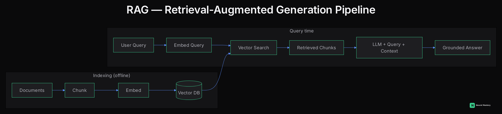

# Retrieval-Augmented Generation (RAG)

An LLM's knowledge is frozen at training time and limited to what fit in its weights. RAG fixes both problems by retrieving relevant information at query time and feeding it into the prompt as grounding context.

## Basic Architecture

1. **Index**: split your documents into chunks, embed each chunk into a vector (see [Foundation Model Internals](./foundation-model-internals.md)), and store them in a vector database (see [Databases](../databases/roadmap.md)).
2. **Retrieve**: embed the user's query the same way, find the most similar chunks (nearest-neighbor search by cosine similarity — see [Linear Algebra](../mathematics-for-ai/linear-algebra.md)).
3. **Generate**: feed the retrieved chunks into the LLM's context alongside the query, and let it generate an answer grounded in that retrieved content.

## Chunking Strategies

- **Fixed-size chunking**: split every N tokens — simple, but can cut sentences/ideas in half.
- **Semantic chunking**: split at natural boundaries (paragraphs, topic shifts) so each chunk is a coherent unit of meaning.
- **Recursive chunking**: try splitting on large boundaries first (sections), fall back to smaller ones (sentences) only if a chunk is still too large.
- **Parent-child chunking**: retrieve using small, precise child chunks, but pass the larger parent chunk (with more surrounding context) to the LLM — balances retrieval precision with generation context.

Chunk size is a real tradeoff: too small loses context; too large dilutes the embedding's specificity and wastes context window on irrelevant text.

## Choosing an Embedding Model

Different embedding models trade off quality, speed, cost, and domain fit (a model tuned on general web text may underperform on legal or medical documents). Dimensionality matters too — higher-dimensional embeddings usually capture more nuance but cost more to store and search at scale.

## Hybrid Search & Re-ranking

Pure vector search can miss exact keyword matches (product codes, names) that a simple keyword search would catch instantly. **Hybrid search** combines vector similarity with traditional keyword search (e.g. BM25), merging both result sets. A **re-ranker** — often a smaller, more expensive-per-item cross-encoder model — then re-scores the combined candidate set with higher precision than the fast initial retrieval step, before the final top-k is passed to the LLM.

## Query Transformation

- **HyDE (Hypothetical Document Embeddings)**: have the LLM first generate a *hypothetical* answer to the query, then embed and search using *that* instead of the raw query — often more similar to real relevant documents than the terse original question.
- **Query decomposition**: break a complex multi-part question into sub-questions, retrieve for each separately.
- **Step-back prompting**: ask a more general question first to retrieve broader context, before answering the specific one.

## GraphRAG

Standard RAG retrieves isolated chunks, which struggles with questions that require connecting facts *across* multiple documents (multi-hop reasoning). GraphRAG instead builds a knowledge graph (see [Databases — Graph](../databases/roadmap.md)) from the source documents, and retrieval can traverse relationships between entities directly, rather than relying purely on chunk-level similarity.

## Evaluating RAG

- **Faithfulness**: does the generated answer actually match what the retrieved context says (or does it hallucinate beyond it)?
- **Relevance**: are the retrieved chunks actually relevant to the query?
- **Context precision/recall**: of the chunks retrieved, how many were relevant (precision); of all relevant chunks that exist, how many were retrieved (recall)?

## Common Failure Modes

- **Hallucination despite correct context** → the model ignores or misreads retrieved content; mitigated with stronger grounding instructions and citation requirements
- **"Lost in the middle"** on long retrieved context → reorder chunks to put the most relevant near the start/end of the prompt
- **Multi-hop questions failing** → GraphRAG, or explicit query decomposition
- **Stale knowledge base** → versioned, incremental re-indexing pipelines rather than full rebuilds
- **PDF/table parsing issues** → dedicated document-layout parsers instead of naive text extraction
- **Per-user access control** → metadata filtering at retrieval time, scoped to what each user is authorized to see

Next: [Evaluation & Serving](./evaluation-and-serving.md) — measuring whether any of this actually works, and running it in production.
