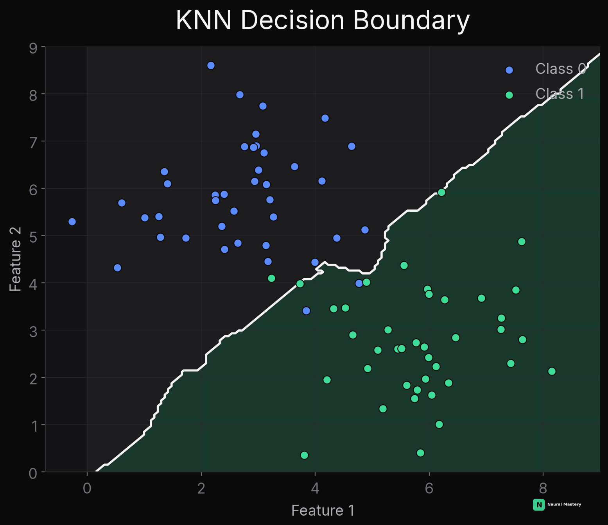

import DecisionBoundaryPlayground from '@site/src/components/viz/DecisionBoundaryPlayground';

# K-Nearest Neighbors, In Full Depth

Every model so far — [linear](./linear-regression.md), [tree-based](./decision-tree.md), [SVM](./support-vector-machines.md) — learns a fixed set of parameters from the training data, then discards the training data at prediction time. KNN does the opposite: it learns nothing, and keeps the entire training set around, making a fresh decision for every new prediction.

## What Is KNN?

To predict for a new point: find the $k$ closest points in the training set, and predict the majority class among them (classification) or their average value (regression). That's the entire algorithm.



Compare this boundary directly to [logistic regression's straight line](./logistic-regression.md#the-decision-boundary), [the decision tree's staircase](./decision-tree.md#why-the-boundary-looks-like-a-staircase), and [LDA's line vs. QDA's curve](./naive-bayes-lda-qda.md#lda-vs-qda) below — KNN's boundary is the most locally flexible of all of them, bending to follow wherever the actual point density shifts from one class to the other, with no global functional form constraining its shape at all.

Click to place your own points and watch a real KNN boundary recompute live — then switch the algorithm selector to compare against a real decision tree on the same points:

<DecisionBoundaryPlayground />

## "Training" Is Instant — Prediction Is the Expensive Part

KNN is called a **lazy learner**: `fit()` does nothing but store the data. All the work happens at prediction time — computing the distance from the query point to *every* training point, an $O(n)$ operation per prediction (see [Algorithms & Data Structures](../mathematics-for-ai/algorithms-data-structures.md)). This is the exact inverse of every other model covered so far, which pay an upfront training cost for cheap predictions afterward.

**This is precisely why approximate nearest-neighbor search matters at scale** — see [Vector Databases](../databases/vector/overview.md), where the same underlying "find the $k$ closest vectors" problem gets solved with HNSW/IVF indexing instead of brute-force $O(n)$ scanning, because RAG retrieval and other production nearest-neighbor systems can't afford to scan millions of vectors per query.

## Distance Metrics

- **Euclidean distance**: $\sqrt{\sum_i (x_i - x_i')^2}$ — the default, straight-line distance (see [Linear Algebra — Norms](../mathematics-for-ai/linear-algebra.md)).
- **Manhattan distance**: $\sum_i |x_i - x_i'|$ — sum of absolute differences; more robust to outliers in individual features than Euclidean.
- **Cosine similarity**: measures angle, not magnitude — the standard choice when comparing embeddings (see [RAG — Retrieve](../llms-genai/rag.md#basic-architecture)), since direction carries the semantic meaning, not vector length.

**Feature scaling matters enormously for KNN** — unlike [decision trees](./decision-tree.md#strengths-and-weaknesses), which only compare a feature to a threshold, KNN's distance calculation is dominated by whichever feature happens to have the largest numeric range. A feature measured in the thousands will swamp a feature measured in single digits unless features are standardized first.

## Choosing K

- **Small $k$** (e.g. $k=1$): the boundary hugs individual training points tightly — low bias, high variance, prone to being thrown off by a single noisy/mislabeled point.
- **Large $k$**: the boundary smooths out, averaging over more neighbors — higher bias, lower variance. In the extreme, $k=n$ just predicts the global majority class for every point, ignoring the query entirely.
- This is the [bias-variance tradeoff](./model-evaluation-metrics.md#bias-variance-tradeoff) again, controlled by a single hyperparameter — chosen via cross-validation (see [ML Workflow Fundamentals](./ml-workflow-fundamentals.md#train--validation--test-splits)) like any other.
- **Practical tip**: use an odd $k$ for binary classification, to avoid tie votes.

## The Curse of Dimensionality

KNN's Achilles' heel. As the number of features grows, the volume of the feature space grows exponentially, and points that were "close" in low dimensions become roughly equidistant from each other in high dimensions — the whole notion of "nearest" neighbor stops being meaningful. This is the concrete, mechanical reason KNN degrades badly on high-dimensional data (many features), while tree-based and linear methods are far less affected — see [Model Evaluation & Metrics — Curse of Dimensionality](./model-evaluation-metrics.md#common-problems--their-state-of-the-art-solutions) for the standard fixes (dimensionality reduction, feature selection).

## Minimal Implementation

```python
import numpy as np
from collections import Counter

def knn_predict(X_train, y_train, x_query, k=5):
    distances = np.sqrt(((X_train - x_query) ** 2).sum(axis=1))
    nearest_idx = np.argsort(distances)[:k]
    nearest_labels = y_train[nearest_idx]
    return Counter(nearest_labels).most_common(1)[0][0]
```

Next: [Naive Bayes, LDA & QDA](./naive-bayes-lda-qda.md) — generative classifiers that model each class's distribution directly, rather than learning a boundary between classes.
