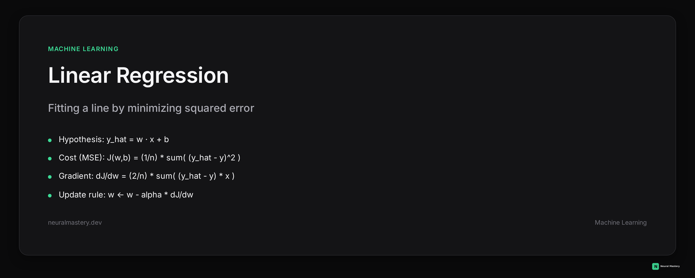
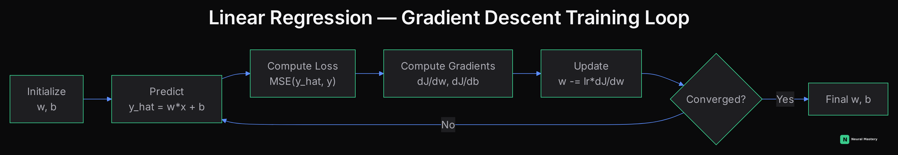
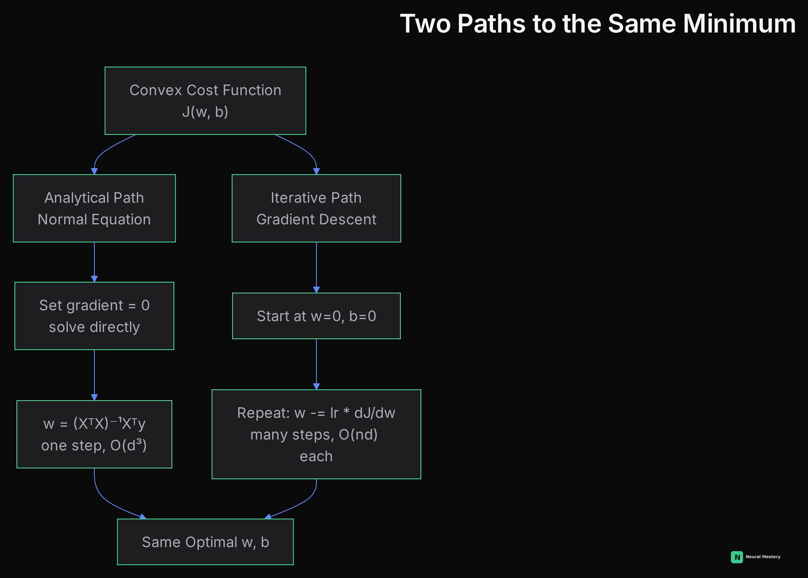

# Linear Regression, In Full Depth

[Supervised Learning](./supervised-learning.md) introduced linear regression in a couple of sentences. This page derives it properly — the cost function, the gradient step by step, the closed-form solution, and where gradient descent actually comes from — because "minimize squared error" means nothing until you've done the derivative by hand at least once.



## 1. The Hypothesis

Linear regression assumes the target is a linear function of the input, plus noise:

$$\hat{y} = w \cdot x + b$$

For multiple features, $x$ becomes a vector $\mathbf{x} \in \mathbb{R}^d$ and $w$ a weight vector $\mathbf{w} \in \mathbb{R}^d$ (see [Linear Algebra](../mathematics-for-ai/linear-algebra.md)):

$$\hat{y} = \mathbf{w}^T \mathbf{x} + b$$

$w$ (the weights) and $b$ (the bias/intercept) are the parameters we need to *learn* — the entire rest of this page is about finding the $w, b$ that make $\hat{y}$ match the real data $y$ as closely as possible.

## 2. The Cost Function (Mean Squared Error)

We need a number that measures "how wrong" a given $(w, b)$ is across the whole dataset of $n$ examples:

$$J(w, b) = \frac{1}{n} \sum_{i=1}^{n} \left( \hat{y}^{(i)} - y^{(i)} \right)^2 = \frac{1}{n} \sum_{i=1}^{n} \left( w x^{(i)} + b - y^{(i)} \right)^2$$

**Why squared error, specifically?** Three reasons that all matter:
- It's differentiable everywhere (unlike absolute error, which has a sharp corner at zero — its derivative is undefined right where the error is smallest, which complicates gradient-based optimization).
- It penalizes large errors disproportionately more than small ones, which is often the right behavior — being off by 10 should hurt more than 10x being off by 1.
- It's exactly the loss function that falls out of assuming Gaussian-distributed noise and doing Maximum Likelihood Estimation (see [Probability & Statistics — MLE vs MAP](../mathematics-for-ai/probability-statistics.md#mle-vs-map)) — minimizing MSE *is* finding the maximum-likelihood parameters under that assumption, not an arbitrary choice.

$J$ is convex in $(w, b)$ (see [Calculus & Optimization — Convexity](../mathematics-for-ai/calculus-optimization.md#convexity)) — there's exactly one minimum, no false valleys to get stuck in. That's what makes everything below work cleanly.

## 3. Deriving the Gradient, Step by Step

To minimize $J$, we need $\dfrac{\partial J}{\partial w}$ and $\dfrac{\partial J}{\partial b}$ — the direction that increases the loss fastest, so we can step in the *opposite* direction (see [Calculus & Optimization — Gradients](../mathematics-for-ai/calculus-optimization.md)).

Start with a single example, error $e^{(i)} = \hat{y}^{(i)} - y^{(i)} = (w x^{(i)} + b) - y^{(i)}$, and its squared contribution to the cost, $\left(e^{(i)}\right)^2$. Apply the chain rule:

$$\frac{\partial}{\partial w}\left(e^{(i)}\right)^2 = 2 e^{(i)} \cdot \frac{\partial e^{(i)}}{\partial w} = 2 e^{(i)} \cdot x^{(i)}$$

because $\dfrac{\partial e^{(i)}}{\partial w} = \dfrac{\partial}{\partial w}\left(w x^{(i)} + b - y^{(i)}\right) = x^{(i)}$ — everything else in $e^{(i)}$ is constant with respect to $w$.

Similarly, $\dfrac{\partial e^{(i)}}{\partial b} = 1$, so:

$$\frac{\partial}{\partial b}\left(e^{(i)}\right)^2 = 2 e^{(i)}$$

Now sum across all $n$ examples and divide by $n$ (matching the $\frac{1}{n}$ in $J$):

$$\frac{\partial J}{\partial w} = \frac{2}{n} \sum_{i=1}^{n} \left( \hat{y}^{(i)} - y^{(i)} \right) x^{(i)} \qquad\qquad \frac{\partial J}{\partial b} = \frac{2}{n} \sum_{i=1}^{n} \left( \hat{y}^{(i)} - y^{(i)} \right)$$

**Reading the intuition directly off the formula:** if a prediction is too high ($\hat{y}^{(i)} > y^{(i)}$), the gradient is positive, so the update step (below) *decreases* $w$ — pulling the prediction back down. If the estimate is already close to correct, the error term is small, so the gradient is small and the update barely moves $w$ at all. The gradient is literally "error times input" — the size of the correction is proportional to both how wrong you are and how much that particular input contributed to the prediction.

## 4. Vectorized Form

Looping over $n$ examples in Python is slow. Stack all examples into a matrix $X \in \mathbb{R}^{n \times d}$ (one row per example) and all targets into $\mathbf{y} \in \mathbb{R}^n$. The predictions for the whole dataset at once:

$$\hat{\mathbf{y}} = X\mathbf{w} + b$$

And the gradient across the entire dataset, as a single matrix expression:

$$\nabla_w J = \frac{2}{n} X^T (\hat{\mathbf{y}} - \mathbf{y})$$

This is the exact same formula as Section 3 — $X^T$ (transpose, see [Linear Algebra](../mathematics-for-ai/linear-algebra.md)) is what turns "multiply each error by its matching input and sum" into one matrix multiplication. This is why frameworks are fast: a GPU does this single matrix multiply in parallel instead of looping example by example.

## 5. The Closed-Form Solution (Normal Equation)

Because $J$ is convex, we can skip iterating entirely and solve for the exact minimum directly: set the gradient to zero and solve.

$$\nabla_w J = 0 \;\;\Rightarrow\;\; X^T(X\mathbf{w} - \mathbf{y}) = 0 \;\;\Rightarrow\;\; X^TX\mathbf{w} = X^T\mathbf{y}$$

$$\mathbf{w} = (X^TX)^{-1}X^T\mathbf{y}$$

This is the **normal equation** — it gives the exact optimal weights in one shot, no learning rate, no iterations. So why doesn't everyone just use this?

**Because $(X^TX)^{-1}$ is expensive and sometimes doesn't exist.** Computing a matrix inverse costs roughly $O(d^3)$ where $d$ is the number of features (see [Algorithms & Data Structures](../mathematics-for-ai/algorithms-data-structures.md)) — fine for a handful of features, prohibitive for thousands. And if features are linearly dependent (multicollinearity), $X^TX$ isn't invertible at all. This is exactly why gradient descent — next section — is the practical default at any real scale, even though the normal equation is "more exact."

## 6. Gradient Descent

Instead of solving in one step, take small repeated steps in the direction that reduces the cost:

$$w \leftarrow w - \alpha \frac{\partial J}{\partial w} \qquad\qquad b \leftarrow b - \alpha \frac{\partial J}{\partial b}$$

where $\alpha$ is the learning rate (see [Calculus & Optimization](../mathematics-for-ai/calculus-optimization.md#gradient-descent-and-its-variants)). The full loop:



Because $J$ is convex, this loop is guaranteed to converge to the global minimum (not just *a* minimum) as long as $\alpha$ is small enough — no local-minima concerns here, unlike the non-convex loss surfaces in [Deep Learning](../deep-learning/roadmap.md).

## 7. Closed-Form vs. Gradient Descent



| | Normal equation | Gradient descent |
|---|---|---|
| Result | Exact minimum in one step | Approximate, improves each iteration |
| Cost | $O(d^3)$ from the matrix inverse | $O(nd)$ per iteration |
| Scales to many features? | No — becomes impractical past a few thousand features | Yes |
| Needs a learning rate? | No | Yes — and a badly chosen one breaks convergence |
| Requires $X^TX$ invertible? | Yes | No |

In practice: normal equation for small, low-dimensional problems where you want the exact answer with no tuning; gradient descent (or a variant — see [Adaptive Optimizers](../mathematics-for-ai/calculus-optimization.md#adaptive-optimizers)) for anything larger, and universally in deep learning where a closed form doesn't exist at all.

## 8. Assumptions Behind Linear Regression

The model — and its statistical guarantees — rely on a few assumptions worth knowing explicitly, since violating them is a common real-world failure mode:

- **Linearity**: the true relationship between features and target is (approximately) linear.
- **Independence of errors**: residuals aren't correlated with each other (violated by time-series data with autocorrelation, for instance).
- **Homoscedasticity**: the variance of the residuals is constant across all values of $x$ — not, say, growing larger for bigger predictions.
- **Normally distributed residuals**: needed specifically for the statistical validity of confidence intervals and hypothesis tests on the coefficients (see [Probability & Statistics](../mathematics-for-ai/probability-statistics.md)), not for the point predictions themselves.
- **No severe multicollinearity**: highly correlated features make $X^TX$ near-singular, causing the normal equation's coefficients to become unstable and hard to interpret.

## 9. Minimal Implementation

The entire training loop from Section 6, in plain NumPy — no framework, so every line maps directly to a formula above:

```python
import numpy as np

def fit_linear_regression(X, y, lr=0.01, epochs=1000):
    n, d = X.shape
    w = np.zeros(d)
    b = 0.0

    for _ in range(epochs):
        y_hat = X @ w + b                  # Section 1: predictions
        error = y_hat - y
        dw = (2 / n) * X.T @ error         # Section 4: vectorized gradient
        db = (2 / n) * np.sum(error)
        w -= lr * dw                       # Section 6: gradient descent update
        b -= lr * db

    return w, b
```

Compare this against the closed-form solution directly:

```python
def fit_normal_equation(X, y):
    return np.linalg.inv(X.T @ X) @ X.T @ y   # Section 5
```

For a small, well-conditioned dataset, both should converge to (nearly) the same $w$ — a good way to sanity-check that a from-scratch gradient descent implementation is actually correct.

---

This is the level of depth every algorithm in [Machine Learning](./roadmap.md) will eventually get here — derived, not just named. See [Model Evaluation & Metrics](./model-evaluation-metrics.md) for how to judge whether the resulting model is actually good.
